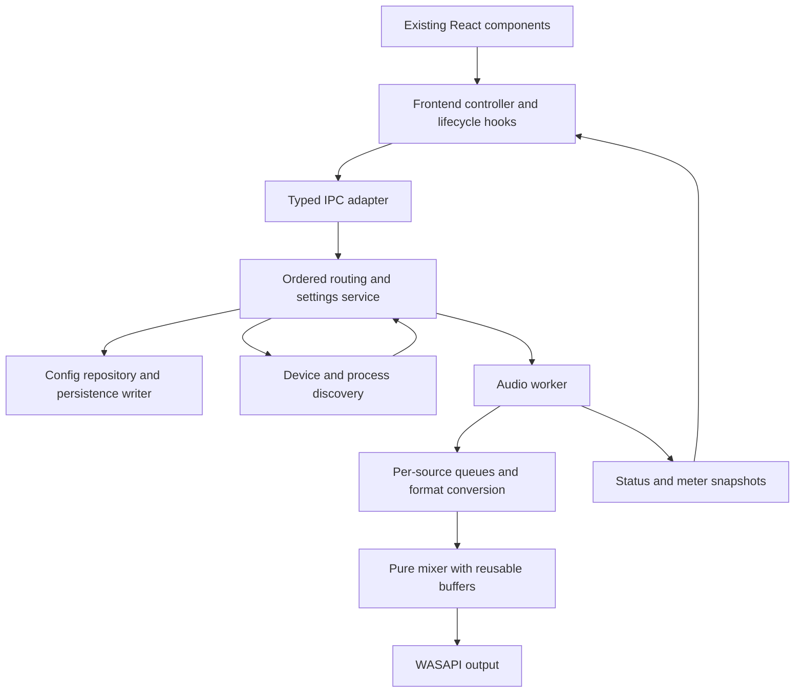

Implementation completed in the working tree (2026-09-27)

All ten findings have code changes and regression coverage. The visible components, labels, workflow, gain/mute rules, source identifiers, and existing config migration remain in place. Hardware behavior still requires the [Windows integration checks](tests/WINDOWS_SMOKE.md).

| Finding | Implementation |
| --- | --- |
| 1. Startup data loss | `src/lib/controller.ts` loads config independently and blocks writes until it succeeds; discovery preserves each successful result. |
| 2. Stop/restart races | The controller serializes mutations, supersedes stale topology requests, and keeps running intent separate from topology revisions. |
| 3. Persistence and live controls | `service.rs` applies controls before persistence; `persistence.rs` coalesces writes, flushes on exit, and atomically replaces files. `config.rs` recovers a valid backup and surfaces other load failures. |
| 4. Blocking audio lifecycle | `audio/discovery.rs` caches discovery; `audio/runtime.rs` gives each capture its own worker, cancellable activation, and bounded queues. Commands execute off the UI thread through one service lock. Stop signals cancellation without joining blocked native calls. |
| 5. Audio timing | Capture/render expose negotiated rates; streaming conversion normalizes to 48 kHz. Fixed output blocks consume per-source reservoirs with bounded clock-drift correction. Discontinuities discard the old timeline. |
| 6. Settings ownership | `AppSettings` contains only shortcuts/startup/tray fields; both sides merge those fields into current config. |
| 7. Recovery | Capture workers reconcile cached devices and process identity, retry failures with bounded backoff, preserve quiet live PIDs, and reopen replacement processes. Device lists refresh periodically and on focus. |
| 8. IPC contracts | DTOs, typed commands, error normalization, and preview fixtures have separate modules. A shared JSON fixture is checked in Rust and TypeScript. |
| 9. Native ownership | Thread-affine COM guards balance initialization and outlive clients. Activation sends owned agile references, including cleanup of late results after cancellation. |
| 10. Tests/releases | Injected controllers/engines/endpoints exercise failures and ordering. PR validation builds/tests the frontend and Windows app/installer. Releases validate prepared manifests before pushing an atomic commit/tag; version checks include Cargo.lock. |

Additional changes extract orchestration from `App.tsx`, keep status polling single-flight, reuse processing buffers and meter maps, and document the [installer template baseline and customizations](src-tauri/nsis/README.md). The existing uninstall data-deletion option now includes the actual config directory.

Implementation validation:

- Frontend: 10 tests passed, covering startup failures, both Stop-ordering cases, settings versus mute, failed commands, stale polling, IPC fields, and release version synchronization.
- Rust: 34 tests passed with `--lib --no-default-features --locked`, covering persistence failure/recovery, activation cancellation, source recovery, PID selection, mixing rules, 44.1/48/96 kHz conversion, packet buffering, prolonged output backpressure, and ten simulated minutes of clock drift.
- Production frontend build passed; the generated CSS is unchanged (`index-Cnv1YBwo.css`).
- Full Windows application and test targets passed cross-compilation checks with `cargo check --target x86_64-pc-windows-msvc --tests --locked` using LLVM's resource compiler on Linux. This checks compilation without linking or running a Windows executable.
- Browser preview: add/remove mic and app sources, Start/Stop, gain, mute/unmute, and shortcut mute during a settings save passed with no browser runtime errors. This uses the preview adapter, not native audio.
- Optimized portable probe (`audio_bench`, eight sources, 240 frames/block, 10,000 blocks): previous mixer allocation pattern 19 allocations/block, current queues/mixer/output conversion 0. Current p99 processing time was 15.8 microseconds against a 5,000-microsecond block; separate 48-to-44.1 kHz output conversion p99 was 10.3 microseconds with 0 allocations/block. The older mixer alone had p99 2.3 microseconds and did not perform queue/drift handling. These host measurements exclude native I/O, telemetry, and scheduling.
- Native Windows audio/driver latency, tray/global shortcut integration, and installer execution remain manual checks; see the linked checklist. Cancelled native workers retain ownership until their OS calls return. Software queues bound accumulated source audio, but no exact cross-device timestamp synchronization is claimed.

---

Architecture review of PipeMic at `1356d47` (2026-09-27)

The most valuable changes are clearer ownership of routing state, separation of persistence from live controls, and an explicit audio timing contract. Keep the existing React components, controls, shortcuts, gain/mute semantics, device choices, saved-config compatibility, and Windows application model. These changes can be made incrementally within the existing application.

The review covers frontend orchestration and transport, Rust commands and configuration, the mixer and WASAPI workers, discovery, Windows integration, installer customization, and release automation. No application source was changed during the initial review. The findings below describe the original commit; links are pinned to that revision. “Reproduced” below means an isolated probe executing callbacks extracted from the actual `App.tsx`, with controlled API responses; it does not mean a Windows desktop or hardware test. Other findings are based on code paths and, where relevant, platform documentation.

1. **High: a discovery failure during startup can overwrite saved sources with defaults.**

   [App.tsx:275](https://github.com/Nuzair46/PipeMic/blob/1356d47/src/App.tsx#L275) loads configuration, devices, sessions, and status in one `Promise.all`. If any discovery call fails, even a successfully loaded configuration is discarded. The `finally` clears `booting`, which triggers `refreshDevices`. If that refresh succeeds, [App.tsx:257](https://github.com/Nuzair46/PipeMic/blob/1356d47/src/App.tsx#L257) selects an output on the still-default config and saves it, including empty source lists. Reproduced with one failing session enumeration followed by a successful refresh.

   Load and validate configuration independently. Track configuration readiness separately from discovery readiness, and prohibit automatic persistence until an authoritative config has loaded. Discovery failure should preserve the last successful data for that subsystem. Regression scenario: saved microphones survive a failed initial session query and a successful retry.

2. **High: a pending topology change can undo an explicit Stop.**

   [App.tsx:220](https://github.com/Nuzair46/PipeMic/blob/1356d47/src/App.tsx#L220) captures `wasRunning`, waits for a save, then starts routing using the captured config. [App.tsx:344](https://github.com/Nuzair46/PipeMic/blob/1356d47/src/App.tsx#L344) stops routing independently. If Stop completes before the pending save response arrives, the earlier source/output change starts routing again. Reproduced using the actual callbacks. Multiple pending changes also lack a revision check for stale restarts and responses.

   Give a routing controller ownership of desired topology, desired running state, and an operation revision. Stop must supersede older restart requests. Apply ordered commands through one backend service, and ensure the frontend does not send an obsolete restart after a newer intent. Keep existing buttons and shortcuts. Regression scenario: delay a topology save, press Stop, release the save, and verify routing remains stopped.

3. **High: disk persistence gates live mute/gain changes and has no recovery boundary.**

   Each slider or mute action sends both `saveConfig` and `updateControls` at [App.tsx:197](https://github.com/Nuzair46/PipeMic/blob/1356d47/src/App.tsx#L197). Both native commands write the whole config. More seriously, [commands.rs:187](https://github.com/Nuzair46/PipeMic/blob/1356d47/src-tauri/src/commands.rs#L187) changes the in-memory config, writes it to disk, and only then updates the engine. A disk-full or access-denied error prevents the live mute from reaching the worker even though the frontend and backend config already reflect it.

   [config.rs:404](https://github.com/Nuzair46/PipeMic/blob/1356d47/src-tauri/src/config.rs#L404) overwrites the destination directly. An interrupted write can leave a truncated file, and [commands.rs:34](https://github.com/Nuzair46/PipeMic/blob/1356d47/src-tauri/src/commands.rs#L34) silently replaces any load error with defaults. This can turn a transient storage failure into lost configuration.

   Use one config repository and one persistence writer. Apply acknowledged live controls independently of disk success, coalesce slider persistence, flush pending changes during controlled shutdown, and replace saved files atomically using a Windows-compatible strategy. Preserve a recoverable last-good config and report load errors through the existing error mechanism. Test write failure during mute, partial/corrupt files, and final-value persistence after rapid changes.

4. **High: discovery and activation can stall every source, and shutdown waits on that work.**

   The routing loop retries missing applications at [engine.rs:519](https://github.com/Nuzair46/PipeMic/blob/1356d47/src-tauri/src/audio/engine.rs#L519). Each retry calls full session/window discovery through [engine.rs:754](https://github.com/Nuzair46/PipeMic/blob/1356d47/src-tauri/src/audio/engine.rs#L754), then may wait up to five seconds for activation at [wasapi_io.rs:249](https://github.com/Nuzair46/PipeMic/blob/1356d47/src-tauri/src/audio/wasapi_io.rs#L249). During that wait, the same worker cannot service otherwise healthy microphones or output. Several failing sources can compound the delay.

   Stop synchronously joins the worker at [engine.rs:625](https://github.com/Nuzair46/PipeMic/blob/1356d47/src-tauri/src/audio/engine.rs#L625). The native commands are synchronous, so disk I/O, enumeration, and worker joins also run on Tauri's main thread. That execution behavior is documented by [Tauri](https://v2.tauri.app/develop/calling-rust/#async-commands).

   Move discovery and capture lifecycle management outside the audio processing loop, with cancellable activation and bounded handoffs. Keep COM clients on their owning threads. Route command work through an ordered background controller rather than merely making every command independently concurrent. Test that an activation timeout does not interrupt an existing mic and that Stop remains responsive during retry.

5. **High for audio correctness: the capture/render contract omits sample rate and clock alignment.**

   [capture.rs:51](https://github.com/Nuzair46/PipeMic/blob/1356d47/src-tauri/src/audio/capture.rs#L51) and [render.rs:34](https://github.com/Nuzair46/PipeMic/blob/1356d47/src-tauri/src/audio/render.rs#L34) exchange bare stereo frames. WASAPI can fall back to a device's native mix format at [wasapi_io.rs:520](https://github.com/Nuzair46/PipeMic/blob/1356d47/src-tauri/src/audio/wasapi_io.rs#L520) and [wasapi_io.rs:671](https://github.com/Nuzair46/PipeMic/blob/1356d47/src-tauri/src/audio/wasapi_io.rs#L671); process loopback also explicitly offers 44.1 kHz at line 773. There is no resampler between these streams and the nominal 48 kHz mixer. When fallback rates differ, a frame-for-frame transfer cannot preserve audio duration. Windows auto-conversion converts between the format supplied to `Initialize` and the endpoint mix format; it does not normalize an arbitrary native-format fallback to PipeMic's internal rate. See [Microsoft's stream flag contract](https://learn.microsoft.com/en-us/windows/win32/coreaudio/audclnt-streamflags-xxx-constants).

   Independently, [engine.rs:469](https://github.com/Nuzair46/PipeMic/blob/1356d47/src-tauri/src/audio/engine.rs#L469) clears all source buffers, reads what is currently available, and emits the maximum read length across sources. Shorter reads become silence immediately. Two streams delivering equal-duration packets at different times can therefore insert gaps or shift their relative timing. The spill buffer preserves oversized packet remainders; it does not align sources. [wasapi_io.rs:330](https://github.com/Nuzair46/PipeMic/blob/1356d47/src-tauri/src/audio/wasapi_io.rs#L330) discards the timestamps offered by [WASAPI GetBuffer](https://learn.microsoft.com/en-us/windows/win32/api/audioclient/nf-audioclient-iaudiocaptureclient-getbuffer).

   Define the internal format explicitly, normalize every negotiated stream to it, and introduce per-source queues consumed on a common output timeline. Account for device-clock drift and bound the latency. Preserve the current summing, gain, clipping, and channel behavior. Test fallback rates, staggered packet arrival, unequal packet sizes, short reads, and prolonged render backpressure. These are code-level risks; their audible impact has not been measured on hardware in this review.

6. **Medium: the settings dialog owns a stale copy of unrelated routing state.**

   [App.tsx:173](https://github.com/Nuzair46/PipeMic/blob/1356d47/src/App.tsx#L173) clones the entire `AppConfig`, although the dialog only edits shortcuts and startup/tray options. Saving sends that whole snapshot to [commands.rs:152](https://github.com/Nuzair46/PipeMic/blob/1356d47/src-tauri/src/commands.rs#L152), replacing live configuration without reconciling the engine. Reproduced: open Settings, mute a microphone through a hotkey, then save Settings; the old mute value returns in the UI and saved config while the worker retains its newer control until another update.

   Give the dialog an `AppSettings` value containing only the fields it edits. Merge that patch into the latest backend config. Keep configuration types and helpers outside presentation components. Test that saving startup settings preserves mute, gain, source selections, and current routing intent.

7. **Medium: source recovery relies on incomplete lifecycle signals.**

   Microphone failures set `capture = None` at [engine.rs:500](https://github.com/Nuzair46/PipeMic/blob/1356d47/src-tauri/src/audio/engine.rs#L500), and the mic loop never retries absent captures. Device lists are refreshed during startup at [App.tsx:311](https://github.com/Nuzair46/PipeMic/blob/1356d47/src/App.tsx#L311); there is no subsequent device-change or focus subscription. The ongoing timer refreshes only application sessions.

   App recovery happens only when the capture object is absent. `active_pid` is assigned but never checked against the current process. A capture that continues yielding silence cannot trigger reconnection to a replacement PID. Microsoft documents that [process loopback yields silence when its target has no rendering streams](https://learn.microsoft.com/en-us/samples/microsoft/windows-classic-samples/applicationloopbackaudio-sample/), so silence alone cannot distinguish a quiet app from a stale target. App-open failures are also discarded at engine line 769.

   Introduce a discovery service with cached snapshots and explicit source states. Reconcile device availability and process identity independently of audio reads, retry with bounded backoff, and retain structured failure reasons. Keep the existing source picker and saved executable matching policy. Test unplug/replug, initially missing microphones, a restarted application with a new PID, and a quiet but healthy app.

8. **Medium: the IPC boundary has no shared error normalization or contract checks.**

   Rust serializes failures as `{ message: string }` at [commands.rs:57](https://github.com/Nuzair46/PipeMic/blob/1356d47/src-tauri/src/commands.rs#L57). [api.ts:117](https://github.com/Nuzair46/PipeMic/blob/1356d47/src/lib/api.ts#L117) forwards rejections unchanged, while UI catches generally use `error instanceof Error ? error.message : String(error)`. Reproduced: the native-style object becomes `[object Object]` in the toast.

   Rust and TypeScript also maintain parallel DTO definitions. The browser fallback in [api.ts:511](https://github.com/Nuzair46/PipeMic/blob/1356d47/src/lib/api.ts#L511) does not model native failure, persistence, or worker startup behavior, so successful browser interaction provides limited backend confidence.

   Normalize native errors once in the transport adapter, use a typed command map, and verify serialized fixtures across both languages; generated bindings are an optional later step. Separate preview fixtures from transport and domain helpers, with injected test adapters for delayed and failing commands. Preserve current command names and JSON fields during the migration.

9. **Medium: Windows resource ownership should be explicit.**

   [windows_wasapi.rs:230](https://github.com/Nuzair46/PipeMic/blob/1356d47/src-tauri/src/audio/windows_wasapi.rs#L230) repeatedly calls `CoInitializeEx`, ignores its result, and never balances successful calls. Microsoft requires [successful COM initialization to be paired with uninitialization](https://learn.microsoft.com/en-us/windows/win32/learnwin32/initializing-the-com-library). A thread-scoped guard should handle the apartment result and outlive every COM object it owns.

   The activation callback turns an owned COM client into an integer pointer at [wasapi_io.rs:205](https://github.com/Nuzair46/PipeMic/blob/1356d47/src-tauri/src/audio/wasapi_io.rs#L205), then ignores channel-send failure at line 179. If activation completes after the receiver times out, nobody reconstructs and releases that reference. Use an ownership-preserving handoff with cleanup on cancellation/send failure, respecting COM thread rules. Test late activation completion and repeated start/stop. This is a static ownership finding, not a measured leak report.

10. **Medium: test boundaries and release ordering leave regressions easy to ship.**

    The 15 existing Rust tests cover pure mixing, spill buffers, meter decay, session filtering, and config migration. They do not exercise routing-worker sequencing or the command/config/engine interaction. The worker is Windows-gated and constructs its dependencies directly, despite already having capture/render traits. [package.json](https://github.com/Nuzair46/PipeMic/blob/1356d47/package.json) has no frontend test command.

    Extract a platform-independent routing coordinator with injected capture/render factories, discovery, persistence, and a clock. Add focused behavior tests for findings 1–7, using fake audio endpoints and delayed responses. Keep a Windows integration check for real activation, device changes, and shutdown.

    The sole [workflow](https://github.com/Nuzair46/PipeMic/blob/1356d47/.github/workflows/ci-build-release.yml#L3) runs manually and pushes its version commit/tag before tests and packaging succeed. It omits `Cargo.lock` from the version update and commit. This is already observable: [Cargo.lock:2208](https://github.com/Nuzair46/PipeMic/blob/1356d47/src-tauri/Cargo.lock#L2208) says `1.6.0`, the manifests say `1.6.1`, the version helper reports success, and `cargo test --locked` fails. Add ordinary PR validation, include the lockfile in version consistency checks, use locked dependency builds, and validate the prepared release before publishing its tag.

Additional improvements, after the correctness work:

- Extract application orchestration from [App.tsx](https://github.com/Nuzair46/PipeMic/blob/1356d47/src/App.tsx) into a controller plus lifecycle hooks. Keep existing presentation components. Separate config, routing topology, live controls, app settings, and telemetry by ownership instead of duplicating mutable snapshots.
- Reuse mixer buffers and source-control lookups. [engine.rs:560](https://github.com/Nuzair46/PipeMic/blob/1356d47/src-tauri/src/audio/engine.rs#L560) clones controls and allocates source inputs/output on the audio path; status publication also rebuilds maps. Publish meter snapshots at the UI's needed rate, with preallocated processing buffers. Measure allocations and processing deadlines before and after.
- Stabilize [status polling](https://github.com/Nuzair46/PipeMic/blob/1356d47/src/App.tsx#L317): it depends on the entire status object, so each response recreates its timer. Use a stable running/stopped cadence, allow at most one request in flight, and ignore stale responses. A backend telemetry channel is another option if warranted, without changing visible meter behavior.
- Consolidate platform paths and keep installer customization auditable. Config lives under `%APPDATA%/PipeMic`, but the uninstall data-removal block at [installer-template.nsi:679](https://github.com/Nuzair46/PipeMic/blob/1356d47/src-tauri/nsis/installer-template.nsi#L679) removes `${BUNDLEID}` directories. The explicit “delete app data” choice therefore misses `config.json`. Track the upstream template version and maintain a small, documented customization diff, with install/update/uninstall smoke checks.

A suitable target remains one desktop application:

Implement in small stages: first add regression coverage and fix startup, command ordering, and settings ownership; then centralize persistence and transport errors; then extract worker lifecycle and audio timing; finally streamline telemetry and packaging. Keep each stage independently reviewable. Audio changes need tests that preserve the current gain/clipping/channel rules and measurements that constrain latency, in addition to the Windows hardware checks.

Original review validation (before the implementation):

- `yarn typecheck`: passed.
- Existing core Rust tests: 15 passed using `--lib --no-default-features` in a temporary source copy. Only the copy's root package version in `Cargo.lock` was refreshed; the original lockfile was preserved.
- Windows backend cross-check: `cargo check --lib --no-default-features --target x86_64-pc-windows-msvc --locked` passed in that copy. This does not validate the full Tauri app or run Windows audio.
- Four isolated probes against the actual frontend callbacks reproduced stale settings, restart after Stop, lost native error text, and saved-source loss after a transient startup discovery failure.
- Original checkout's `cargo test --lib --no-default-features --locked`: failed because the lockfile requires the package-version update. `node tools/version-bump.mjs --check` incorrectly reports full synchronization because it only checks the three manifests.
- `yarn build`: TypeScript completed, but Vite could not start because this installed `node_modules` lacks `@rollup/rollup-linux-x64-gnu`. This is a local dependency limitation, not evidence of a frontend source defect.
- Live Windows audio, full desktop behavior, and installer execution were not tested on this Linux host.
